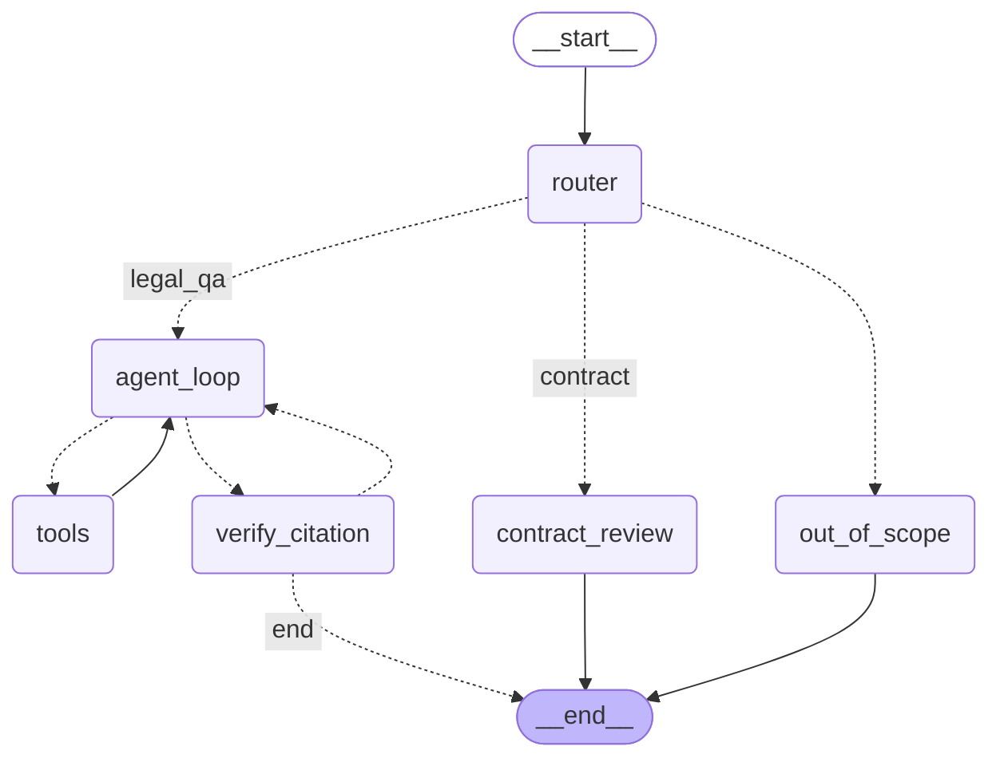

# AI Agent tư vấn Luật Lao động Việt Nam

Agent trả lời câu hỏi về Bộ luật Lao động Việt Nam kèm trích dẫn điều luật kiểm chứng được, tự tính chính xác các khoản trợ cấp/lương, tự hỏi lại khi thiếu thông tin, và rà soát hợp đồng lao động để phát hiện điều khoản sai luật.

> Xem [PLAN.md](./PLAN.md) để biết lộ trình đầy đủ, tiến độ từng buổi và các ghi chú kỹ thuật chi tiết hơn.

## Kiến trúc



`router` phân loại câu hỏi (tra cứu luật / rà soát hợp đồng / ngoài phạm vi). `agent_loop` gọi công cụ (tra luật, tính toán, hỏi lại người dùng — `ask_user` dùng LangGraph `interrupt()` để dừng và chờ người dùng trả lời) cho tới khi đủ dữ liệu để trả lời. `verify_citation` kiểm tra bằng code mọi "Điều X" agent trích trong câu trả lời có thực sự nằm trong evidence đã tra được không; nếu có Điều bịa, agent bị bắt trả lời lại (tối đa 2 vòng).

Pipeline dữ liệu: `vbpl.vn` (Playwright, vượt chặn WAF) → parser tách theo Chương/Điều/Khoản (giữ cấu trúc phân cấp, không cắt theo độ dài cố định) → embedding `BAAI/bge-m3` (dense 1024 chiều + sparse) tạo trên Kaggle GPU → Qdrant (hybrid search dense+sparse, RRF) → rerank `BAAI/bge-reranker-v2-m3`.

## Kết quả

### Retrieval (Hit@5 / MRR@5, đo trên Kaggle GPU T4)

| Phiên bản | Dev (n=35) Hit@5 | Dev MRR@5 | Test (n=85) Hit@5 | Test MRR@5 |
|---|---|---|---|---|
| V1 — dense only | 0.971 | 0.884 | 0.976 | 0.903 |
| V2 — hybrid (dense+sparse, RRF) | **1.000** | 0.910 | 0.976 | 0.901 |
| V3 — hybrid + rerank | **1.000** | 0.895 | **0.988** | **0.940** |

→ Rerank cải thiện rõ nhất ở MRR (thứ hạng kết quả đúng cao hơn), quan trọng khi top-1 được dùng làm ngữ cảnh chính.

### Sinh câu trả lời (giám khảo LLM 1-5, trích dẫn precision/recall)

| Phiên bản | n | Judge (1-5) | Citation P | Citation R | Độ trễ p50 |
|---|---|---|---|---|---|
| V0 — không RAG | 40 | 3.03 | 0.75 | 0.09 | 115s |
| V1 — dense RAG | 40 | 2.78 | 0.64 | 0.66 | 117s |

⚠️ **Chưa hoàn thành**: V2/V3 (hybrid, rerank) và V4 (agent đầy đủ) chưa chạy được trên bộ dev/test đầy đủ — trong quá trình đánh giá, quota Gemini (5 key) và Groq (200k token/ngày) đều cạn cùng lúc (một phần do một tiến trình chạy nền bị trùng không phát hiện kịp), nên không đủ dữ liệu để so sánh công bằng. Độ trễ p50 ~115s cũng bất thường cao — phần lớn thời gian là chờ retry giữa các key Gemini hết quota, không phản ánh tốc độ thực khi quota còn đủ. Số liệu V0/V1 ở trên giữ lại để tham khảo xu hướng (RAG tăng recall trích dẫn rõ rệt: 0.09 → 0.66) nhưng **không nên coi là kết luận cuối cùng**.

Bộ câu hỏi: 40 câu dev / 100 câu test, chia 4 nhóm — `tra_cuu` (tra 1 điều), `nhieu_dieu` (cần gộp nhiều điều), `tinh_huong` (cần tính toán), `ngoai_pham_vi` (phải từ chối).

### Rà soát hợp đồng

Trên 10 hợp đồng mẫu tự tạo (2 đúng, 8 có lỗi cài cắm có chủ đích): **precision = recall = 1.0** (14/14 lỗi phát hiện đúng, không có false positive).

## Quyết định thiết kế

- **Chia chunk theo Điều/Khoản, không theo độ dài cố định** — giữ nguyên đơn vị pháp lý nhỏ nhất có ý nghĩa độc lập, tránh cắt ngang một quy định.
- **Hybrid search + rerank thay vì chỉ dense** — luật có nhiều thuật ngữ/con số chính xác (tỷ lệ %, số ngày) mà sparse/tìm từ khóa bắt tốt hơn dense thuần.
- **Không để LLM tự tính toán** — mọi phép tính (trợ cấp thôi việc, lương thử việc, làm thêm giờ...) đi qua hàm Python thuần (`src/tools/calculators.py`), LLM chỉ được gọi tool và trình bày kết quả. Tránh lỗi số học/làm tròn của LLM.
- **Kiểm tra trích dẫn bằng code, không tin LLM tự báo cáo đúng** — `verify_citation` đối chiếu "Điều X" trong câu trả lời với danh sách Điều thực sự được tool trả về (parse từ `chunk_id`, không quét nội dung chunk vì một chunk có thể *dẫn chiếu* tới Điều khác mà không đồng nghĩa Điều đó đã được tra đúng).
- **Chia dev/test tách biệt, mỗi bộ đều có nhóm `ngoai_pham_vi`** — đo được cả khả năng từ chối đúng lúc, không chỉ khả năng trả lời đúng.
- **Xoay vòng nhiều Gemini API key + fallback Groq, nhớ key nào đã chết** — free tier Gemini chỉ ~20 request/ngày/key; `src/llm.py` tự động bỏ qua key đã biết là hết quota trong ngày (lưu vào `.gemini_dead_keys.json`, tự reset qua ngày mới) thay vì thử lại tất cả mỗi lần gọi.

## Hạn chế và lỗi đã biết

- **Đánh giá sinh câu trả lời chưa đầy đủ** (xem phần Kết quả ở trên) — cần chạy lại V0-V4 khi quota ổn định, lý tưởng là dùng một provider trong suốt một lượt chạy để so sánh công bằng.
- **RAGAS faithfulness** (đo trong PLAN.md) chưa triển khai — bị hoãn có chủ đích do giới hạn thời gian, ưu tiên các chỉ số citation precision/recall và giám khảo LLM trước.
- **Reranker chậm trên CPU** (~30s/query trên i7-8565U dù đã giới hạn `max_length=384` và giảm ứng viên) — khả thi cho demo/đánh giá offline, chưa khả thi cho sản phẩm thời gian thực; hướng khắc phục (chuyển ONNX INT8) đã lên kế hoạch ở Tuần 6 nhưng chưa làm.
- **Dữ liệu nguồn giới hạn 3 văn bản** (Bộ luật Lao động 2019, NĐ 145/2020, NĐ 293/2025) — chưa có Luật BHXH 2024, chưa xử lý hiệu lực theo thời gian khi văn bản có nhiều đợt sửa đổi.

## Cách chạy

### Docker (khuyến nghị)

```bash
cp .env.example .env               # điền GEMINI_API_KEY (hoặc GEMINI_API_KEYS), GROQ_API_KEY
# data/embeddings/embeddings.parquet không nằm trong git (file lớn, sinh từ Kaggle,
# xem mục Kaggle bên dưới) — cần có sẵn file này trước khi build.
docker compose build
docker compose up -d
make docker-index                  # nạp chunks + embeddings vào Qdrant trong container
```

- API: http://localhost:8000 (`/health`, `/chat`, `/chat/resume`, `/review-contract`, docs tại `/docs`)
- UI: http://localhost:8501

### Chạy trực tiếp trên máy (không Docker)

```bash
python -m venv .venv
.venv\Scripts\activate              # Windows; Linux/Mac: source .venv/bin/activate
pip install -r requirements.txt
docker run -p 6333:6333 qdrant/qdrant   # hoặc dùng Qdrant Cloud, sửa QDRANT_URL trong .env
make index                          # nạp dữ liệu vào Qdrant
uvicorn src.api.main:app --reload   # terminal 1
streamlit run src/ui/app.py         # terminal 2
```

### Kaggle (tạo embedding, đánh giá retrieval trên GPU)

Xem `kaggle/01_embed_chunks.ipynb` (tạo `embeddings.parquet` từ `data/processed/chunks.jsonl`) và `kaggle/02_eval_retrieval.ipynb` (đo Hit@5/MRR@5 cho V1-V3 trên GPU T4). Cấu hình `~/.kaggle/kaggle.json` trước, chi tiết ở [PLAN.md § 6](./PLAN.md#6-hướng-dẫn-làm-việc-với-kaggle).

### Test và lint

```bash
make test    # pytest
make lint    # ruff check . (kaggle/*.ipynb loại trừ — xem pyproject.toml)
```

## Lời lưu ý pháp lý

Nội dung do agent trả lời chỉ mang tính tham khảo, không thay thế tư vấn pháp lý chuyên nghiệp. Dữ liệu nguồn cập nhật tới **10/11/2025** (Nghị định 293/2025/NĐ-CP, hiệu lực từ 01/01/2026) — xem `data/raw/sources.yaml` để biết chi tiết từng văn bản và ngày hiệu lực.
